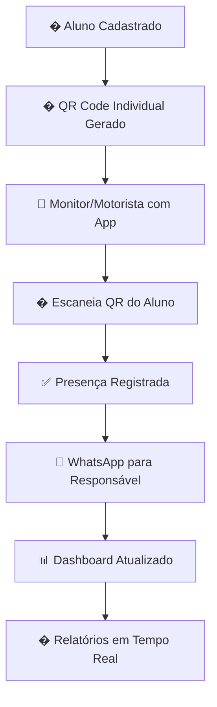

# 🚌 Sistema de Controle de Presenças em Ônibus Escolar

<div align="center">


</div>

> **Sistema completo para controle de presenças de alunos em embarque/desembarque de ônibus escolares com QR Code e gestão em tempo real**

---

## 📋 **Sobre o Sistema**

O **Sistema de Controle de Presenças em Ônibus Escolar** é uma solução moderna desenvolvida para instituições educacionais que precisam controlar e monitorar o embarque e desembarque de alunos em ônibus escolares. O sistema oferece:

- 🎯 **Controle de Presenças** em tempo real via QR Code
- 👥 **Gestão de Alunos** com dados acadêmicos e de contato
- 🚌 **Controle da Frota** com capacidades e rotas
- 📱 **Sistema de QR Code** individual para cada aluno
- ⚡ **Alertas Automáticos** para responsáveis via WhatsApp
- 📊 **Dashboard em Tempo Real** com status de embarque
- 📱 **Interface Mobile** para motoristas e monitores

---

## ✨ **Funcionalidades Principais**

### � **Sistema de Presenças com QR Code**
- ✅ QR Code individual para cada aluno
- ✅ Leitura via smartphone do monitor/motorista
- ✅ Registro de embarque e desembarque em tempo real
- ✅ Validação automática de horários e rotas
- ✅ Histórico completo de viagens por aluno

### 👥 **Gestão de Alunos e Responsáveis**
- ✅ Cadastro completo com dados acadêmicos e pessoais
- ✅ Informações de contato dos responsáveis
- ✅ Autorização de transporte e permissões WhatsApp
- ✅ Fotos dos alunos para identificação
- ✅ Histórico de presenças e faltas

### 🚌 **Controle da Frota e Rotas**
- ✅ Cadastro de ônibus com capacidades e identificação
- ✅ Definição de rotas e pontos de parada
- ✅ Alocação de alunos por ônibus e rota
- ✅ Controle de motoristas e monitores
- ✅ Monitoramento de ocupação em tempo real

### ⚡ **Alertas e Notificações Automáticas**
- ✅ Notificação via WhatsApp para responsáveis
- ✅ Confirmação de embarque e chegada
- ✅ Alertas de ausência ou atraso
- ✅ Relatórios diários de presenças
- ✅ Notificações de emergência

### 📊 **Dashboard e Monitoramento**
- ✅ Status em tempo real de todos os ônibus
- ✅ Lista de alunos embarcados por veículo
- ✅ Alertas de capacidade e segurança
- ✅ Relatórios de frequência e pontualidade
- ✅ Gráficos de utilização do transporte

### 📱 **Interface Mobile para Campo**
- ✅ App mobile para motoristas e monitores
- ✅ Scanner QR Code otimizado
- ✅ Interface offline para áreas sem sinal
- ✅ Sincronização automática quando conectado
- ✅ Emergência com botão de pânico

---

## 🔄 **Fluxo de Operação Diária**

### 🌅 **Embarque Matutino**
1. 📍 **Monitor/Motorista** chega ao ponto de embarque
2. 📱 **Abre o app mobile** no smartphone
3. 🔍 **Escaneia QR Code** do aluno ao embarcar
4. ✅ **Sistema registra presença** e horário automaticamente
5. 📨 **WhatsApp automático** confirma embarque aos pais
6. 📊 **Dashboard atualiza** status em tempo real

### 🏫 **Chegada na Escola**
1. 🎯 **Monitor registra** chegada na escola
2. 📝 **Sistema gera relatório** de alunos embarcados
3. 🏫 **Escola recebe lista** de presenças via sistema
4. 📊 **Atualização automática** do dashboard

### 🌆 **Embarque Vespertino**
1. 🔄 **Processo similar** ao matutino
2. ✅ **Validação automática** de alunos autorizados
3. 📨 **Notificação de saída** para responsáveis
4. 🚌 **Controle de ocupação** em tempo real

### 🏠 **Chegada aos Pontos**
1. 📍 **Desembarque nos pontos** com registro QR
2. ✅ **Confirmação de entrega** aos responsáveis
3. 📊 **Relatório final** do dia gerado automaticamente
4. 📈 **Estatísticas** atualizadas no dashboard

---

## 🏗️ **Arquitetura do Sistema**

```
📁 SISTEMA DE CONTROLE DE PRESENÇAS/
│
├── 📁 admin/                    # 🔧 Administração do Sistema
│   ├── install.php             # Instalação inicial do banco
│   ├── update_database.php     # Atualizações do schema
│   └── maintenance/            # Scripts de manutenção
│
├── 📁 api/                     # 🌐 APIs REST  
│   ├── presencas.php          # API de controle de presenças
│   ├── alunos.php             # API de gestão de alunos
│   ├── onibus.php             # API de controle da frota
│   └── qr_codes.php           # API de QR Codes individuais
│
├── 📁 assets/                  # 🎨 Recursos Estáticos
│   ├── css/                   # Estilos do sistema
│   ├── js/                    # JavaScript para scanners
│   └── images/                # Fotos dos alunos
│
├── 📁 config/                  # ⚙️ Configurações
│   ├── config.php             # Configuração principal
│   ├── whatsapp_config.php    # Config. notificações WhatsApp
│   └── qr_config.php          # Config. sistema QR Code
│
├── 📁 mobile/                  # � Interface Mobile
│   ├── scanner.php            # Scanner QR para embarque
│   ├── offline.php            # Modo offline
│   └── sync.php               # Sincronização de dados
│
├── 📁 includes/                # 🧩 Componentes Reutilizáveis
│   ├── layout-professional.php # Layout principal
│   ├── navbar-professional.php # Navegação do sistema
│   └── qr_functions.php       # Funções QR Code
│
├── 📁 reports/                 # � Relatórios e Estatísticas
│   ├── presencas_diarias.php  # Relatório diário de presenças
│   ├── frequencia_alunos.php  # Frequência por aluno
│   └── ocupacao_onibus.php    # Relatório de ocupação
│
├── 📁 notifications/           # � Sistema de Notificações
│   ├── whatsapp_sender.php    # Envio WhatsApp
│   ├── templates/             # Templates de mensagens
│   └── queue/                 # Fila de envios
│
├── 📁 qr_codes/               # 🔍 QR Codes dos Alunos
│   ├── individual/            # QR Codes individuais por aluno
│   └── backup/                # Backup dos QR Codes
│
├── 📁 scripts/                 # 🔧 Scripts Utilitários
│   ├── backup_presencas.php   # Backup de presenças
│   ├── cleanup_qr.php         # Limpeza de QR Codes
│   └── sync_mobile.php        # Sincronização mobile
│
├── 📁 sql/                     # 🗄️ Scripts SQL
│   ├── presencas_schema.sql   # Schema de presenças
│   ├── qr_codes_schema.sql    # Schema QR Codes
│   └── updates/               # Atualizações do schema
│
├── 📄 index.php                # 🏠 Dashboard Principal
├── 📄 alunos-professional.php  # � Gestão de Alunos
├── 📄 onibus-professional.php  # � Gestão de Frota
├── 📄 presencas-professional.php # ✅ Controle de Presenças
├── 📄 alocacoes-professional.php # 🗺️ Gestão de Rotas/Alocações
└── 📄 dashboard-professional.php # 📊 Dashboard Detalhado
```

---

## 🚀 **Páginas do Sistema**

| 🏠 **Página** | 📝 **Descrição** | ⚡ **Funcionalidades Principais** |
|:---|:---|:---|
| **`index.php`** | Dashboard Principal | Status em tempo real, presenças do dia, ocupação dos ônibus |
| **`presencas-professional.php`** | Controle de Presenças | Scanner QR, histórico, relatórios de frequência |
| **`alunos-professional.php`** | Gestão de Alunos | Cadastro completo, QR individuais, dados dos responsáveis |
| **`onibus-professional.php`** | Gestão de Frota | Ônibus, rotas, capacidades, motoristas e monitores |
| **`alocacoes-professional.php`** | Gestão de Rotas | Alocação aluno-ônibus-rota, otimização de ocupação |
| **`dashboard-professional.php`** | Analytics Avançado | Relatórios detalhados, gráficos de frequência, estatísticas |

---

## 📊 **Modelo de Dados Focado em Presenças**

### 🗄️ **Estrutura Principal do Banco**

```sql
-- ✅ PRESENÇAS (Tabela Principal)
CREATE TABLE presencas (
    id INT PRIMARY KEY AUTO_INCREMENT,
    aluno_id INT NOT NULL,
    onibus_id INT NOT NULL,
    data_presenca DATETIME NOT NULL,
    tipo_registro ENUM('embarque', 'desembarque') NOT NULL,
    qr_code_usado VARCHAR(255),
    localizacao_gps VARCHAR(100),
    monitor_responsavel VARCHAR(100),
    created_at TIMESTAMP DEFAULT CURRENT_TIMESTAMP,
    FOREIGN KEY (aluno_id) REFERENCES alunos(id),
    FOREIGN KEY (onibus_id) REFERENCES onibus(id)
);

-- 🔍 QR CODES INDIVIDUAIS
CREATE TABLE qr_codes (
    id INT PRIMARY KEY AUTO_INCREMENT,
    aluno_id INT NOT NULL UNIQUE,
    codigo_qr VARCHAR(255) NOT NULL UNIQUE,
    data_geracao DATETIME NOT NULL,
    ativo BOOLEAN DEFAULT TRUE,
    validade DATETIME,
    tentativas_uso INT DEFAULT 0,
    FOREIGN KEY (aluno_id) REFERENCES alunos(id)
);

-- 👥 ALUNOS COM DADOS DE RESPONSÁVEIS
CREATE TABLE alunos (
    id INT PRIMARY KEY AUTO_INCREMENT,
    nome VARCHAR(255) NOT NULL,
    rg VARCHAR(20),
    rm VARCHAR(20),
    serie VARCHAR(50),
    curso VARCHAR(100),
    telefone VARCHAR(50),
    data_aniversario DATE,
    foto_perfil VARCHAR(255),
    
    -- Dados dos Responsáveis
    responsavel_nome VARCHAR(255) NOT NULL,
    responsavel_telefone VARCHAR(50),
    responsavel_whatsapp VARCHAR(50),
    whatsapp_permissao BOOLEAN DEFAULT TRUE,
    telefone_emergencia VARCHAR(50),
    
    -- Dados de Transporte
    endereco_completo TEXT,
    ponto_embarque VARCHAR(255),
    observacoes_medicas TEXT,
    autorizacao_transporte BOOLEAN DEFAULT TRUE,
    
    created_at TIMESTAMP DEFAULT CURRENT_TIMESTAMP
);

-- 🚌 ÔNIBUS E ROTAS
CREATE TABLE onibus (
    id INT PRIMARY KEY AUTO_INCREMENT,
    numero VARCHAR(10) NOT NULL UNIQUE,
    placa VARCHAR(10),
    tipo ENUM('ônibus', 'van', 'micro-ônibus') NOT NULL,
    capacidade INT NOT NULL,
    motorista_nome VARCHAR(255),
    monitor_nome VARCHAR(255),
    rota_descricao TEXT,
    turno ENUM('matutino', 'vespertino', 'ambos') DEFAULT 'ambos',
    ativo BOOLEAN DEFAULT TRUE,
    created_at TIMESTAMP DEFAULT CURRENT_TIMESTAMP
);

-- 🗺️ ALOCAÇÕES DE ALUNOS POR ÔNIBUS
CREATE TABLE alocacoes_onibus (
    id INT PRIMARY KEY AUTO_INCREMENT,
    aluno_id INT NOT NULL,
    onibus_id INT NOT NULL,
    ponto_embarque VARCHAR(255),
    horario_embarque TIME,
    turno ENUM('matutino', 'vespertino') NOT NULL,
    ativo BOOLEAN DEFAULT TRUE,
    observacoes TEXT,
    created_at TIMESTAMP DEFAULT CURRENT_TIMESTAMP,
    FOREIGN KEY (aluno_id) REFERENCES alunos(id),
    FOREIGN KEY (onibus_id) REFERENCES onibus(id),
    UNIQUE KEY unique_aluno_turno (aluno_id, turno)
);

-- � AUTORIZAÇÕES E NOTIFICAÇÕES
CREATE TABLE autorizacoes (
    id INT PRIMARY KEY AUTO_INCREMENT,
    aluno_id INT NOT NULL,
    tipo_autorizacao ENUM('transporte', 'whatsapp', 'emergencia') NOT NULL,
    autorizado_por VARCHAR(255),
    data_autorizacao DATETIME NOT NULL,
    validade DATE,
    ativo BOOLEAN DEFAULT TRUE,
    FOREIGN KEY (aluno_id) REFERENCES alunos(id)
);
```

---

## 🔧 **Instalação e Configuração**

### 📋 **Pré-requisitos**

| Requisito | Versão Mínima | Recomendado |
|:---|:---:|:---:|
| **PHP** | 7.4+ | 8.0+ |
| **MySQL** | 5.7+ | 8.0+ |
| **Apache/Nginx** | Qualquer | Nginx |
| **Extensões PHP** | mysqli, gd, curl | + mbstring, json |

### ⚙️ **Configuração Inicial**

#### 1️⃣ **Configurar Banco de Dados**
```php
// config/config.php
function getDatabaseConfig() {
    return [
        'host' => '177.153.208.104',
        'usuario' => 'onibus',
        'senha' => 'Devisate@2025@',
        'banco' => 'onibus',
        'ambiente' => 'online'
    ];
}
```

#### 2️⃣ **Configurar WhatsApp (Opcional)**
```php
// config/whatsapp_config.php
define('WHATSAPP_API_TOKEN', 'seu_token_api');
define('WHATSAPP_PHONE_ID', 'seu_phone_id');
define('MENSAGEM_EMBARQUE', 'Seu filho {nome} embarcou no ônibus {onibus} às {horario}');
define('MENSAGEM_CHEGADA', 'Seu filho {nome} chegou no destino às {horario}');
```

#### 3️⃣ **Executar Instalação**
```bash
# Acesse via navegador:
http://seudominio.com/admin/install.php

# Ou execute via linha de comando:
php admin/install.php
```

#### 4️⃣ **Configurar Permissões**
```bash
# Permissões para QR codes e notificações
chmod 755 qr_codes/
chmod 755 notifications/queue/
chmod 755 mobile/offline/
```

---

## 📱 **Sistema de QR Code Individual - Guia Completo**

### 🎯 **Como Funciona o Controle de Presenças**



### 🔗 **Estrutura dos QR Codes Individuais**

```
Cada aluno possui um QR Code único:
Formato: ALN-{ID_ALUNO}-{HASH_SEGURANÇA}
Exemplo: ALN-00042-X7K9M2P5

Dados do QR Code:
- ID único do aluno
- Hash de segurança
- Data de validade
- Turno autorizado (matutino/vespertino)
```

### 📋 **Processo de Embarque Diário**

1. **🌅 Preparação**: Monitor acessa app mobile no smartphone
2. **📍 Chegada ao Ponto**: Ônibus chega ao ponto de embarque
3. **🔍 Scanner QR**: Aluno apresenta QR Code individual
4. **✅ Registro**: Monitor escaneia e registra presença
5. **📨 Notificação**: WhatsApp automático para responsável
6. **📊 Atualização**: Dashboard atualiza status em tempo real

### 🛡️ **Segurança e Validações**

- ✅ QR Codes únicos e criptografados por aluno
- ✅ Validação de horário e turno autorizado
- ✅ Controle de tentativas de uso indevido
- ✅ Localização GPS do embarque (opcional)
- ✅ Backup offline para áreas sem internet
- ✅ Sincronização automática quando reconectado

---

## 📊 **Relatórios e Analytics em Tempo Real**

### � **Dashboard Principal - Métricas Instantâneas**

- **🚌 Status da Frota**: Localização e ocupação em tempo real
- **👥 Alunos Embarcados**: Lista atualizada por ônibus
- **📊 Taxa de Presença**: Percentuais diários, semanais e mensais
- **⚠️ Alertas**: Ausências, atrasos e emergências
- **� Mapa de Rotas**: Visualização GPS dos ônibus (se disponível)

### 📋 **Relatórios Disponíveis**

| 📄 **Relatório** | 📝 **Descrição** | ⏱️ **Período** |
|:---|:---|:---|
| **Presenças Diárias** | Lista de embarques por dia | Diário |
| **Frequência por Aluno** | Histórico individual de presenças | Mensal |
| **Ocupação por Ônibus** | Taxa de utilização da frota | Semanal |
| **Faltas Consecutivas** | Alunos com ausências prolongadas | Tempo Real |
| **Relatório para Escola** | Dados consolidados para direção | Mensal |

### 🎨 **Interface e Design do Sistema**

### 🖥️ **Características do Design Profissional**

- **🎯 Foco na Funcionalidade**: Interface otimizada para uso rápido e eficiente
- **📱 Mobile-First**: Prioridade para dispositivos móveis (monitores no campo)
- **♿ Acessibilidade**: Cores contrastantes e navegação via teclado
- **⚡ Performance**: Carregamento rápido e otimizado

### 🧩 **Componentes da Interface**

#### 📊 **Cards Estatísticos**
```php
// Exemplo de card estatístico
<div class="stat-card">
    <div class="stat-icon">
        <i class="fas fa-users"></i>
    </div>
    <div class="stat-value">1,247</div>
    <div class="stat-label">Alunos Cadastrados</div>
</div>
```

#### 📋 **Tabelas Avançadas**
- Ordenação por colunas
- Filtros em tempo real
- Busca inteligente
- Paginação automática
- Exportação de dados

#### 📈 **Gráficos Interativos**
- Chart.js para visualizações
- Gráficos de linha, barra e pizza
- Dados em tempo real
- Responsivos e animados

### 🎨 **Paleta de Cores**

| Cor | Hex | Uso |
|:---|:---:|:---|
| **Azul Principal** | `#2563eb` | Botões primários, links |
| **Verde Sucesso** | `#10b981` | Confirmações, status ativo |
| **Amarelo Ônibus** | `#f59e0b` | Destacar ônibus, avisos |
| **Vermelho Erro** | `#ef4444` | Erros, exclusões |
| **Cinza Neutro** | `#6b7280` | Textos secundários |

---

## 🔐 **Segurança e Boas Práticas**

### 🛡️ **Medidas de Segurança Implementadas**

#### **Validação e Sanitização**
```php
// Exemplo de sanitização de dados
$nome = filter_var($_POST['nome'], FILTER_SANITIZE_STRING);
$email = filter_var($_POST['email'], FILTER_VALIDATE_EMAIL);
$telefone = preg_replace('/[^0-9]/', '', $_POST['telefone']);
```

#### **Proteção SQL Injection**
```php
// Uso de prepared statements
$stmt = $conn->prepare("SELECT * FROM alunos WHERE evento_id = ?");
$stmt->bind_param("i", $evento_id);
$stmt->execute();
```

#### **Proteção XSS**
```php
// Escape de dados de saída
echo htmlspecialchars($dados_usuario, ENT_QUOTES, 'UTF-8');
```

#### **Validação de Arquivos**
- Tipos de arquivo permitidos
- Tamanho máximo definido
- Verificação de extensão e MIME type
- Armazenamento em diretório seguro

### 🔒 **Configurações de Segurança Recomendadas**

#### **Apache (.htaccess)**
```apache
# Ocultar arquivos sensíveis
<Files "config.php">
    Order Allow,Deny
    Deny from all
</Files>

# Prevenir execução de PHP em uploads
<Directory "public/uploads">
    php_flag engine off
</Directory>
```

#### **Nginx**
```nginx
# Bloquear acesso a arquivos sensíveis
location ~ /config/ {
    deny all;
    return 404;
}

# Prevenir execução de PHP em uploads
location ~ ^/public/uploads/.*\.php$ {
    deny all;
    return 404;
}
```

---

## 📈 **Métricas e Analytics**

### 📊 **Dashboard Principal**

#### **Estatísticas Gerais**
- 📅 **Total de Eventos Ativos**: Eventos em andamento
- 👥 **Alunos Cadastrados**: Total de inscrições válidas
- 🚌 **Ônibus na Frota**: Veículos disponíveis
- 🗺️ **Alocações Realizadas**: Distribuições confirmadas

#### **Gráficos Avançados**
- **📈 Evolução de Inscrições**: Gráfico de linha temporal
- **🥧 Distribuição por Curso**: Gráfico de pizza
- **📊 Ocupação da Frota**: Gráfico de barras
- **🗺️ Alocações por Evento**: Gráfico de área

### 📋 **Relatórios Disponíveis**

#### **Relatório de Eventos**
```php
// Dados incluídos:
- Nome e período do evento
- Total de inscrições
- Ônibus alocados
- Taxa de ocupação
- Status de alocação
```

#### **Relatório de Alunos**
```php
// Dados incluídos:
- Informações pessoais
- Evento de inscrição
- Data/hora da inscrição
- Ônibus alocado
- Status da alocação
```

#### **Relatório da Frota**
```php
// Dados incluídos:
- Dados do veículo
- Capacidade total vs ocupada
- Eventos vinculados
- Histórico de uso
- Eficiência da alocação
```

---

## 🛠️ **Manutenção e Troubleshooting**

### 🔧 **Ferramentas de Manutenção**

#### **Scripts de Administração**
| Script | Função | Localização |
|:---|:---|:---|
| `install.php` | Instalação completa | `/admin/` |
| `update_database.php` | Atualizações do schema | `/admin/` |
| `backup.php` | Backup automático | `/scripts/` |
| `cleanup.php` | Limpeza de dados antigos | `/scripts/` |

#### **Ferramentas de Debug**
```php
// debug/test_connection.php - Testar conexão DB
// debug/test_qr_generation.php - Testar geração QR
// debug/test_allocation.php - Testar alocação
// debug/diagnostics.php - Diagnóstico completo
```

### 🚨 **Resolução de Problemas Comuns**

#### **❌ Erro de Conexão com Banco**
```bash
Sintoma: "Connection failed" ou timeouts
Solução:
1. Verificar config/config.php
2. Testar credenciais manualmente
3. Verificar status do MySQL
4. Conferir permissões de rede
```

#### **❌ QR Codes Não Carregam**
```bash
Sintoma: Imagens quebradas ou 404
Solução:
1. Verificar permissões da pasta public/
2. Testar geração manual: debug/test_qr_generation.php
3. Verificar biblioteca GD instalada
4. Conferir URL base no config
```

#### **❌ Alocações Incorretas**
```bash
Sintoma: Alunos não alocados ou alocação duplicada
Solução:
1. Executar script de limpeza: scripts/cleanup.php
2. Re-executar alocação automática
3. Verificar capacidades dos ônibus
4. Conferir integridade dos dados
```

#### **❌ Interface Não Carrega**
```bash
Sintoma: Páginas em branco ou erros 500
Solução:
1. Verificar logs do Apache/Nginx
2. Conferir permissões de arquivos
3. Testar sintaxe PHP: php -l arquivo.php
4. Verificar extensões PHP necessárias
```

### 📝 **Logs do Sistema**

#### **Localização dos Logs**
```bash
Sistema: /var/log/apache2/ ou /var/log/nginx/
PHP: /var/log/php_errors.log
MySQL: /var/log/mysql/
Aplicação: debug/logs/ (personalizado)
```

#### **Monitoramento Recomendado**
- **Disk Space**: Pasta de uploads e QR codes
- **Database Size**: Crescimento das tabelas
- **Error Logs**: Erros PHP e SQL
- **Performance**: Tempo de resposta das páginas

---

## 📝 **Histórico de Versões**

### 🆕 **v2.0 (Setembro 2025) - Versão Profissional**
```diff
+ ✅ Interface completamente redesenhada com design profissional
+ ✅ Sistema de QR Code implementado com formulários dinâmicos  
+ ✅ Alocação automática inteligente baseada em algoritmos
+ ✅ Dashboard profissional com gráficos em tempo real
+ ✅ Estrutura de banco de dados otimizada e normalizada
+ ✅ Código limpo, documentado e seguindo padrões PSR
+ ✅ Sistema responsivo para todos os dispositivos
+ ✅ APIs REST para integração externa
+ ✅ Sistema de logs e debug avançado
+ ✅ Segurança aprimorada com validações robustas
```

### 📜 **v1.0 (Agosto 2025) - Versão Base**
```diff
+ Sistema básico de cadastros manuais
+ Interface simples com Bootstrap
+ Alocação manual de alunos
+ Relatórios básicos em HTML
+ Estrutura inicial do banco de dados
```

---

## 🤝 **Contribuição e Desenvolvimento**

### 👨‍💻 **Para Desenvolvedores**

#### **Padrões de Código**
```php
// PSR-4 Autoloading
// PSR-12 Coding Style
// Documentação inline obrigatória
// Nomenclatura em português para variáveis de negócio

// Exemplo de função documentada:
/**
 * Realiza alocação automática de alunos nos ônibus
 * 
 * @param int $evento_id ID do evento
 * @param array $opcoes Opções de alocação
 * @return array Resultado da alocação
 * @throws Exception Em caso de erro na alocação
 */
function alocarAlunosAutomaticamente($evento_id, $opcoes = []) {
    // Implementação...
}
```

#### **Estrutura de Desenvolvimento**
```bash
# Clone do repositório
git clone [repo-url]

# Configuração local
cp config/config.exemplo.php config/config.php
# Editar config.php com dados locais

# Instalação das dependências
composer install  # Se usando Composer

# Setup do banco local
php admin/install.php

# Servidor de desenvolvimento
php -S localhost:8000
```

#### **Workflow de Contribuição**
1. **Fork** do projeto
2. **Crie uma branch** para sua feature (`git checkout -b feature/nova-funcionalidade`)
3. **Commit** suas mudanças (`git commit -am 'Adiciona nova funcionalidade'`)
4. **Push** para a branch (`git push origin feature/nova-funcionalidade`)
5. **Abra um Pull Request**

### 🧪 **Testes**

#### **Executar Testes**
```bash
# Testes de conexão
php debug/test_connection.php

# Testes de QR Code
php debug/test_qr_generation.php

# Testes de alocação
php debug/test_allocation.php

# Diagnóstico completo
php debug/diagnostics.php
```

#### **Cobertura de Testes**
- ✅ Conexão com banco de dados
- ✅ Geração e validação de QR Codes
- ✅ Algoritmo de alocação automática
- ✅ APIs REST e endpoints
- ✅ Validação de formulários
- ✅ Segurança e sanitização

---

## 📞 **Suporte e Documentação**

### 🆘 **Canais de Suporte**

#### **Auto-diagnóstico**
```bash
# Execute o diagnóstico automático
http://seudominio.com/debug/diagnostics.php

# Verificar logs do sistema  
tail -f debug/logs/system.log

# Testar componentes individuais
http://seudominio.com/debug/test_[componente].php
```

#### **Documentação Técnica**
- 📁 **`/docs/header-template.php`**: Template para desenvolvimento
- 📁 **`/debug/`**: Ferramentas de diagnóstico
- 📁 **Código fonte**: Comentários inline detalhados
- 📁 **`/sql/`**: Documentação do banco de dados

#### **Recursos Adicionais**
- 🌐 **Wiki Online**: [Em desenvolvimento]
- 📧 **Email**: [Configurar no sistema]
- 💬 **Chat**: [Integração futura]
- 🎥 **Tutoriais**: [Em produção]

### 🔄 **Atualizações e Manutenção**

#### **Verificar Atualizações**
```bash
# Manual: Verificar versão atual
echo "Versão atual: 2.0";

# Automático: Script de verificação
php admin/check_updates.php
```

#### **Processo de Atualização**
1. **Backup**: Sempre faça backup antes de atualizar
2. **Teste**: Execute em ambiente de teste primeiro
3. **Migração**: Use scripts de migração quando disponíveis
4. **Verificação**: Execute diagnósticos pós-atualização

---

## 🏆 **Créditos e Licença**

### 👥 **Equipe de Desenvolvimento**
- **Arquitetura**: Sistema modular e escalável
- **Frontend**: Interface responsiva e moderna  
- **Backend**: APIs REST e lógica de negócio
- **Database**: Modelagem otimizada
- **QR System**: Integração completa

### 📄 **Licença**
```
MIT License

Copyright (c) 2025 Sistema de Transporte Escolar

Permission is hereby granted, free of charge, to any person obtaining a copy
of this software and associated documentation files (the "Software"), to deal
in the Software without restriction, including without limitation the rights
to use, copy, modify, merge, publish, distribute, sublicense, and/or sell
copies of the Software, and to permit persons to whom the Software is
furnished to do so, subject to the following conditions:

The above copyright notice and this permission notice shall be included in all
copies or substantial portions of the Software.

THE SOFTWARE IS PROVIDED "AS IS", WITHOUT WARRANTY OF ANY KIND, EXPRESS OR
IMPLIED, INCLUDING BUT NOT LIMITED TO THE WARRANTIES OF MERCHANTABILITY,
FITNESS FOR A PARTICULAR PURPOSE AND NONINFRINGEMENT.
```

### 🙏 **Agradecimentos**
- **PHP Community**: Pela linguagem robusta e comunidade ativa
- **Chart.js**: Pelos gráficos interativos e responsivos
- **Font Awesome**: Pelos ícones profissionais
- **Bootstrap**: Pela base de CSS responsivo
- **MySQL**: Pelo banco de dados confiável

---

<div align="center">

### 🚌 **Sistema de Gerenciamento de Transporte Escolar**
**v2.0 Professional Edition**

*Desenvolvido com ❤️ para instituições educacionais*

---

**[⬆️ Voltar ao Topo](#-sistema-de-gerenciamento-de-transporte-escolar)**

</div>