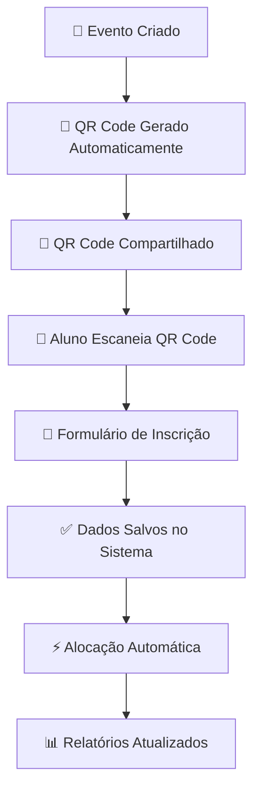

# 🚌 Sistema de Gerenciamento de Transporte Escolar

<div align="center">


</div>

> **Sistema completo e profissional para gerenciamento de eventos escolares, alunos, frota de ônibus e alocações automáticas com QR Code**

---

## 📋 **Sobre o Sistema**

O **Sistema de Gerenciamento de Transporte Escolar** é uma solução moderna e completa desenvolvida para instituições educacionais que precisam organizar o transporte de alunos para eventos. O sistema oferece:

- 🎯 **Gestão Completa de Eventos** com QR Codes para inscrições
- 👥 **Cadastro e Gerenciamento de Alunos** via web e mobile
- 🚌 **Controle Total da Frota** (ônibus, vans, micro-ônibus)
- ⚡ **Alocação Automática Inteligente** baseada em algoritmos
- 📊 **Dashboard Profissional** com métricas em tempo real
- 📱 **Interface Responsiva** para todos os dispositivos

---

## ✨ **Funcionalidades Principais**

### 📅 **Gerenciamento de Eventos**
- ✅ Cadastro completo com período, local e descrição
- ✅ Geração automática de QR Codes únicos
- ✅ Formulários de inscrição personalizados
- ✅ Estatísticas em tempo real
- ✅ Sistema completo de CRUD (Create, Read, Update, Delete)

### 👥 **Gestão de Alunos**
- ✅ Cadastro via formulário administrativo ou QR Code público
- ✅ Organização por série, curso, telefone e dados pessoais
- ✅ Filtros avançados e busca inteligente
- ✅ Validação automática de dados
- ✅ Interface moderna e intuitiva

### 🚌 **Gerenciamento de Frota**
- ✅ Cadastro de ônibus, vans e micro-ônibus
- ✅ Configuração de capacidades e dias de reserva
- ✅ Vinculação específica por evento
- ✅ Controle de disponibilidade em tempo real
- ✅ Relatórios de utilização da frota

### ⚡ **Alocação Automática Inteligente**
- ✅ Algoritmo baseado na ordem cronológica de inscrição
- ✅ Otimização automática de ocupação
- ✅ Respeito aos limites de capacidade
- ✅ Distribuição equilibrada entre veículos
- ✅ Relatórios detalhados de alocação

### 📱 **Sistema de QR Code**
- ✅ Geração automática para cada evento
- ✅ URLs públicas e seguras
- ✅ Formulários responsivos
- ✅ Validação em tempo real
- ✅ Integração automática com o sistema

### 📊 **Dashboard e Relatórios**
- ✅ Métricas em tempo real
- ✅ Gráficos interativos (Chart.js)
- ✅ Estatísticas de ocupação
- ✅ Relatórios de eventos e alocações
- ✅ Exportação de dados

---

## 🏗️ **Arquitetura do Sistema**

```
📁 SISTEMA DE TRANSPORTE ESCOLAR/
│
├── 📁 admin/                    # 🔧 Administração do Sistema
│   ├── install.php             # Instalação inicial do banco
│   ├── update_database.php     # Atualizações do schema
│   └── maintenance/            # Scripts de manutenção
│
├── 📁 api/                     # 🌐 APIs REST
│   ├── eventos.php            # API de eventos
│   ├── alunos.php             # API de alunos
│   └── alocacoes.php          # API de alocações
│
├── 📁 assets/                  # 🎨 Recursos Estáticos
│   ├── css/                   # Estilos customizados
│   ├── js/                    # JavaScript customizado
│   └── images/                # Imagens e ícones
│
├── 📁 config/                  # ⚙️ Configurações
│   ├── config.php             # Configuração principal
│   ├── config_email.php       # Configuração de email
│   └── config_timezone.php    # Configuração de fuso horário
│
├── 📁 debug/                   # 🔍 Ferramentas de Debug
│   ├── test_*.php             # Scripts de teste
│   └── diagnostics/           # Diagnósticos do sistema
│
├── 📁 includes/                # 🧩 Componentes Reutilizáveis
│   ├── layout-professional.php # Layout principal
│   ├── navbar-professional.php # Barra de navegação
│   └── functions.php          # Funções utilitárias
│
├── 📁 inscricao/               # 📝 Sistema de Inscrições
│   ├── index.php              # Formulário público
│   ├── processar.php          # Processamento das inscrições
│   └── assets/                # Recursos do formulário
│
├── 📁 pages/                   # 📄 Páginas Secundárias
│   ├── eventos.php            # Gestão de eventos (legacy)
│   └── utilities/             # Utilitários diversos
│
├── 📁 public/                  # 🌍 Arquivos Públicos
│   ├── qr-codes/              # QR Codes gerados
│   ├── uploads/               # Uploads de usuários
│   └── temp/                  # Arquivos temporários
│
├── 📁 scripts/                 # 🔧 Scripts Utilitários
│   ├── backup.php             # Backup automático
│   ├── cleanup.php            # Limpeza de dados
│   └── migration/             # Scripts de migração
│
├── 📁 sql/                     # 🗄️ Scripts SQL
│   ├── create_tables.sql      # Criação das tabelas
│   ├── initial_data.sql       # Dados iniciais
│   └── updates/               # Atualizações do schema
│
├── 📄 index.php                # 🏠 Dashboard Principal
├── 📄 eventos-professional.php # 📅 Gestão de Eventos
├── 📄 alunos-professional.php  # 👥 Gestão de Alunos
├── 📄 onibus-professional.php  # 🚌 Gestão de Frota
├── 📄 alocacoes-professional.php # 🗺️ Gestão de Alocações
└── 📄 dashboard-professional.php # 📊 Dashboard Detalhado
```

---

## 🚀 **Páginas do Sistema**

| 🏠 **Página** | 📝 **Descrição** | ⚡ **Funcionalidades Principais** |
|:---|:---|:---|
| **`index.php`** | Dashboard Principal | Visão geral, estatísticas gerais, acesso rápido aos módulos |
| **`eventos-professional.php`** | Gestão de Eventos | CRUD completo, geração de QR Codes, estatísticas por evento |
| **`alunos-professional.php`** | Gestão de Alunos | Lista de alunos, filtros avançados, informações detalhadas |
| **`onibus-professional.php`** | Gestão de Frota | CRUD de veículos, capacidades, tipos (ônibus/van/carro) |
| **`alocacoes-professional.php`** | Gestão de Alocações | Visualização de alocações aluno-ônibus-evento |
| **`dashboard-professional.php`** | Dashboard Analytics | Gráficos avançados, métricas detalhadas, relatórios |

---

## 📊 **Modelo de Dados**

### 🗄️ **Estrutura do Banco de Dados**

```sql
-- 📅 EVENTOS
CREATE TABLE eventos (
    id INT PRIMARY KEY AUTO_INCREMENT,
    nome VARCHAR(255) NOT NULL,
    data_inicio DATE NOT NULL,
    data_fim DATE NOT NULL,
    local VARCHAR(255),
    descricao TEXT,
    created_at TIMESTAMP DEFAULT CURRENT_TIMESTAMP
);

-- 👥 ALUNOS
CREATE TABLE alunos (
    id INT PRIMARY KEY AUTO_INCREMENT,
    nome VARCHAR(255) NOT NULL,
    evento_id INT,
    data_inscricao TIMESTAMP DEFAULT CURRENT_TIMESTAMP,
    rg VARCHAR(20),
    rm VARCHAR(20),
    serie VARCHAR(50),
    curso VARCHAR(100),
    telefone VARCHAR(50),
    data_aniversario DATE,
    whatsapp_permissao TINYINT(1) DEFAULT 0,
    created_at TIMESTAMP DEFAULT CURRENT_TIMESTAMP,
    FOREIGN KEY (evento_id) REFERENCES eventos(id)
);

-- 🚌 ÔNIBUS
CREATE TABLE onibus (
    id INT PRIMARY KEY AUTO_INCREMENT,
    numero VARCHAR(10) NOT NULL,
    tipo ENUM('ônibus', 'van', 'carro') NOT NULL,
    capacidade INT NOT NULL,
    evento_id INT,
    dias_reservados INT DEFAULT 1,
    created_at TIMESTAMP DEFAULT CURRENT_TIMESTAMP,
    FOREIGN KEY (evento_id) REFERENCES eventos(id)
);

-- 🗺️ ALOCAÇÕES
CREATE TABLE alocacoes_onibus (
    id INT PRIMARY KEY AUTO_INCREMENT,
    aluno_id INT NOT NULL,
    onibus_id INT NOT NULL,
    evento_id INT NOT NULL,
    created_at TIMESTAMP DEFAULT CURRENT_TIMESTAMP,
    FOREIGN KEY (aluno_id) REFERENCES alunos(id),
    FOREIGN KEY (onibus_id) REFERENCES onibus(id),
    FOREIGN KEY (evento_id) REFERENCES eventos(id)
);

-- 📱 QR CODES
CREATE TABLE qr_codes (
    id INT PRIMARY KEY AUTO_INCREMENT,
    evento_id INT NOT NULL,
    codigo VARCHAR(50) UNIQUE NOT NULL,
    url_completa TEXT,
    ativo TINYINT(1) DEFAULT 1,
    created_at TIMESTAMP DEFAULT CURRENT_TIMESTAMP,
    FOREIGN KEY (evento_id) REFERENCES eventos(id)
);
```

---

## 🔧 **Instalação e Configuração**

### 📋 **Pré-requisitos**

| Requisito | Versão Mínima | Recomendado |
|:---|:---:|:---:|
| **PHP** | 7.4+ | 8.0+ |
| **MySQL** | 5.7+ | 8.0+ |
| **Apache/Nginx** | Qualquer | Nginx |
| **Extensões PHP** | mysqli, gd, curl | + mbstring, json |

### ⚙️ **Configuração Inicial**

#### 1️⃣ **Configurar Banco de Dados**
```php
// config/config.php
function getDatabaseConfig() {
    return [
        'host' => 'localhost',        // ou seu host
        'usuario' => 'seu_usuario',   // usuário do MySQL
        'senha' => 'sua_senha',       // senha do MySQL
        'banco' => 'nome_do_banco',   // nome do banco
        'ambiente' => 'producao'      // ou 'desenvolvimento'
    ];
}
```

#### 2️⃣ **Executar Instalação**
```bash
# Acesse via navegador:
http://seudominio.com/admin/install.php

# Ou execute via linha de comando:
php admin/install.php
```

#### 3️⃣ **Configurar Permissões**
```bash
# Permissões para upload e QR codes
chmod 755 public/
chmod 755 public/qr-codes/
chmod 755 public/uploads/
```

#### 4️⃣ **Acessar o Sistema**
```
URL Principal: http://seudominio.com/
Login Admin: Via index.php (sem autenticação por padrão)
```

---

## 📱 **Sistema de QR Code - Guia Completo**

### 🎯 **Como Funciona**



### 🔗 **Estrutura das URLs**

```
Padrão: /inscricao/?evento={ID}&codigo={CODIGO_UNICO}
Exemplo: /inscricao/?evento=1&codigo=EVT2025ABC123

Parâmetros:
- evento: ID do evento no banco de dados
- codigo: Código único de 6-8 caracteres
```

### 📋 **Processo de Inscrição**

1. **Acesso**: Aluno escaneia QR Code ou acessa URL
2. **Formulário**: Preenche dados pessoais e acadêmicos
3. **Validação**: Sistema valida dados em tempo real
4. **Confirmação**: Recebe confirmação de inscrição
5. **Alocação**: Sistema aloca automaticamente em ônibus disponível

### 🛡️ **Segurança**

- ✅ Códigos únicos e não sequenciais
- ✅ Validação de evento ativo
- ✅ Sanitização de todos os inputs
- ✅ Proteção contra SQL Injection
- ✅ Rate limiting para evitar spam

---

## 🎨 **Interface e Design**

### 🖥️ **Características do Design**

- **🎯 Design Profissional**: Interface moderna, limpa e intuitiva
- **📱 Totalmente Responsivo**: Funciona perfeitamente em desktop, tablet e mobile
- **🎨 Consistência Visual**: Padrão unificado em todas as páginas
- **♿ Acessibilidade**: Cores contrastantes e navegação via teclado
- **⚡ Performance**: Carregamento rápido e otimizado

### 🧩 **Componentes da Interface**

#### 📊 **Cards Estatísticos**
```php
// Exemplo de card estatístico
<div class="stat-card">
    <div class="stat-icon">
        <i class="fas fa-users"></i>
    </div>
    <div class="stat-value">1,247</div>
    <div class="stat-label">Alunos Cadastrados</div>
</div>
```

#### 📋 **Tabelas Avançadas**
- Ordenação por colunas
- Filtros em tempo real
- Busca inteligente
- Paginação automática
- Exportação de dados

#### 📈 **Gráficos Interativos**
- Chart.js para visualizações
- Gráficos de linha, barra e pizza
- Dados em tempo real
- Responsivos e animados

### 🎨 **Paleta de Cores**

| Cor | Hex | Uso |
|:---|:---:|:---|
| **Azul Principal** | `#2563eb` | Botões primários, links |
| **Verde Sucesso** | `#10b981` | Confirmações, status ativo |
| **Amarelo Ônibus** | `#f59e0b` | Destacar ônibus, avisos |
| **Vermelho Erro** | `#ef4444` | Erros, exclusões |
| **Cinza Neutro** | `#6b7280` | Textos secundários |

---

## 🔐 **Segurança e Boas Práticas**

### 🛡️ **Medidas de Segurança Implementadas**

#### **Validação e Sanitização**
```php
// Exemplo de sanitização de dados
$nome = filter_var($_POST['nome'], FILTER_SANITIZE_STRING);
$email = filter_var($_POST['email'], FILTER_VALIDATE_EMAIL);
$telefone = preg_replace('/[^0-9]/', '', $_POST['telefone']);
```

#### **Proteção SQL Injection**
```php
// Uso de prepared statements
$stmt = $conn->prepare("SELECT * FROM alunos WHERE evento_id = ?");
$stmt->bind_param("i", $evento_id);
$stmt->execute();
```

#### **Proteção XSS**
```php
// Escape de dados de saída
echo htmlspecialchars($dados_usuario, ENT_QUOTES, 'UTF-8');
```

#### **Validação de Arquivos**
- Tipos de arquivo permitidos
- Tamanho máximo definido
- Verificação de extensão e MIME type
- Armazenamento em diretório seguro

### 🔒 **Configurações de Segurança Recomendadas**

#### **Apache (.htaccess)**
```apache
# Ocultar arquivos sensíveis
<Files "config.php">
    Order Allow,Deny
    Deny from all
</Files>

# Prevenir execução de PHP em uploads
<Directory "public/uploads">
    php_flag engine off
</Directory>
```

#### **Nginx**
```nginx
# Bloquear acesso a arquivos sensíveis
location ~ /config/ {
    deny all;
    return 404;
}

# Prevenir execução de PHP em uploads
location ~ ^/public/uploads/.*\.php$ {
    deny all;
    return 404;
}
```

---

## 📈 **Métricas e Analytics**

### 📊 **Dashboard Principal**

#### **Estatísticas Gerais**
- 📅 **Total de Eventos Ativos**: Eventos em andamento
- 👥 **Alunos Cadastrados**: Total de inscrições válidas
- 🚌 **Ônibus na Frota**: Veículos disponíveis
- 🗺️ **Alocações Realizadas**: Distribuições confirmadas

#### **Gráficos Avançados**
- **📈 Evolução de Inscrições**: Gráfico de linha temporal
- **🥧 Distribuição por Curso**: Gráfico de pizza
- **📊 Ocupação da Frota**: Gráfico de barras
- **🗺️ Alocações por Evento**: Gráfico de área

### 📋 **Relatórios Disponíveis**

#### **Relatório de Eventos**
```php
// Dados incluídos:
- Nome e período do evento
- Total de inscrições
- Ônibus alocados
- Taxa de ocupação
- Status de alocação
```

#### **Relatório de Alunos**
```php
// Dados incluídos:
- Informações pessoais
- Evento de inscrição
- Data/hora da inscrição
- Ônibus alocado
- Status da alocação
```

#### **Relatório da Frota**
```php
// Dados incluídos:
- Dados do veículo
- Capacidade total vs ocupada
- Eventos vinculados
- Histórico de uso
- Eficiência da alocação
```

---

## 🛠️ **Manutenção e Troubleshooting**

### 🔧 **Ferramentas de Manutenção**

#### **Scripts de Administração**
| Script | Função | Localização |
|:---|:---|:---|
| `install.php` | Instalação completa | `/admin/` |
| `update_database.php` | Atualizações do schema | `/admin/` |
| `backup.php` | Backup automático | `/scripts/` |
| `cleanup.php` | Limpeza de dados antigos | `/scripts/` |

#### **Ferramentas de Debug**
```php
// debug/test_connection.php - Testar conexão DB
// debug/test_qr_generation.php - Testar geração QR
// debug/test_allocation.php - Testar alocação
// debug/diagnostics.php - Diagnóstico completo
```

### 🚨 **Resolução de Problemas Comuns**

#### **❌ Erro de Conexão com Banco**
```bash
Sintoma: "Connection failed" ou timeouts
Solução:
1. Verificar config/config.php
2. Testar credenciais manualmente
3. Verificar status do MySQL
4. Conferir permissões de rede
```

#### **❌ QR Codes Não Carregam**
```bash
Sintoma: Imagens quebradas ou 404
Solução:
1. Verificar permissões da pasta public/
2. Testar geração manual: debug/test_qr_generation.php
3. Verificar biblioteca GD instalada
4. Conferir URL base no config
```

#### **❌ Alocações Incorretas**
```bash
Sintoma: Alunos não alocados ou alocação duplicada
Solução:
1. Executar script de limpeza: scripts/cleanup.php
2. Re-executar alocação automática
3. Verificar capacidades dos ônibus
4. Conferir integridade dos dados
```

#### **❌ Interface Não Carrega**
```bash
Sintoma: Páginas em branco ou erros 500
Solução:
1. Verificar logs do Apache/Nginx
2. Conferir permissões de arquivos
3. Testar sintaxe PHP: php -l arquivo.php
4. Verificar extensões PHP necessárias
```

### 📝 **Logs do Sistema**

#### **Localização dos Logs**
```bash
Sistema: /var/log/apache2/ ou /var/log/nginx/
PHP: /var/log/php_errors.log
MySQL: /var/log/mysql/
Aplicação: debug/logs/ (personalizado)
```

#### **Monitoramento Recomendado**
- **Disk Space**: Pasta de uploads e QR codes
- **Database Size**: Crescimento das tabelas
- **Error Logs**: Erros PHP e SQL
- **Performance**: Tempo de resposta das páginas

---

## 📝 **Histórico de Versões**

### 🆕 **v2.0 (Setembro 2025) - Versão Profissional**
```diff
+ ✅ Interface completamente redesenhada com design profissional
+ ✅ Sistema de QR Code implementado com formulários dinâmicos  
+ ✅ Alocação automática inteligente baseada em algoritmos
+ ✅ Dashboard profissional com gráficos em tempo real
+ ✅ Estrutura de banco de dados otimizada e normalizada
+ ✅ Código limpo, documentado e seguindo padrões PSR
+ ✅ Sistema responsivo para todos os dispositivos
+ ✅ APIs REST para integração externa
+ ✅ Sistema de logs e debug avançado
+ ✅ Segurança aprimorada com validações robustas
```

### 📜 **v1.0 (Agosto 2025) - Versão Base**
```diff
+ Sistema básico de cadastros manuais
+ Interface simples com Bootstrap
+ Alocação manual de alunos
+ Relatórios básicos em HTML
+ Estrutura inicial do banco de dados
```

---

## 🤝 **Contribuição e Desenvolvimento**

### 👨‍💻 **Para Desenvolvedores**

#### **Padrões de Código**
```php
// PSR-4 Autoloading
// PSR-12 Coding Style
// Documentação inline obrigatória
// Nomenclatura em português para variáveis de negócio

// Exemplo de função documentada:
/**
 * Realiza alocação automática de alunos nos ônibus
 * 
 * @param int $evento_id ID do evento
 * @param array $opcoes Opções de alocação
 * @return array Resultado da alocação
 * @throws Exception Em caso de erro na alocação
 */
function alocarAlunosAutomaticamente($evento_id, $opcoes = []) {
    // Implementação...
}
```

#### **Estrutura de Desenvolvimento**
```bash
# Clone do repositório
git clone [repo-url]

# Configuração local
cp config/config.exemplo.php config/config.php
# Editar config.php com dados locais

# Instalação das dependências
composer install  # Se usando Composer

# Setup do banco local
php admin/install.php

# Servidor de desenvolvimento
php -S localhost:8000
```

#### **Workflow de Contribuição**
1. **Fork** do projeto
2. **Crie uma branch** para sua feature (`git checkout -b feature/nova-funcionalidade`)
3. **Commit** suas mudanças (`git commit -am 'Adiciona nova funcionalidade'`)
4. **Push** para a branch (`git push origin feature/nova-funcionalidade`)
5. **Abra um Pull Request**

### 🧪 **Testes**

#### **Executar Testes**
```bash
# Testes de conexão
php debug/test_connection.php

# Testes de QR Code
php debug/test_qr_generation.php

# Testes de alocação
php debug/test_allocation.php

# Diagnóstico completo
php debug/diagnostics.php
```

#### **Cobertura de Testes**
- ✅ Conexão com banco de dados
- ✅ Geração e validação de QR Codes
- ✅ Algoritmo de alocação automática
- ✅ APIs REST e endpoints
- ✅ Validação de formulários
- ✅ Segurança e sanitização

---

## 📞 **Suporte e Documentação**

### 🆘 **Canais de Suporte**

#### **Auto-diagnóstico**
```bash
# Execute o diagnóstico automático
http://seudominio.com/debug/diagnostics.php

# Verificar logs do sistema  
tail -f debug/logs/system.log

# Testar componentes individuais
http://seudominio.com/debug/test_[componente].php
```

#### **Documentação Técnica**
- 📁 **`/docs/header-template.php`**: Template para desenvolvimento
- 📁 **`/debug/`**: Ferramentas de diagnóstico
- 📁 **Código fonte**: Comentários inline detalhados
- 📁 **`/sql/`**: Documentação do banco de dados

#### **Recursos Adicionais**
- 🌐 **Wiki Online**: [Em desenvolvimento]
- 📧 **Email**: [Configurar no sistema]
- 💬 **Chat**: [Integração futura]
- 🎥 **Tutoriais**: [Em produção]

### 🔄 **Atualizações e Manutenção**

#### **Verificar Atualizações**
```bash
# Manual: Verificar versão atual
echo "Versão atual: 2.0";

# Automático: Script de verificação
php admin/check_updates.php
```

#### **Processo de Atualização**
1. **Backup**: Sempre faça backup antes de atualizar
2. **Teste**: Execute em ambiente de teste primeiro
3. **Migração**: Use scripts de migração quando disponíveis
4. **Verificação**: Execute diagnósticos pós-atualização

---

## 🏆 **Créditos e Licença**

### 👥 **Equipe de Desenvolvimento**
- **Arquitetura**: Sistema modular e escalável
- **Frontend**: Interface responsiva e moderna  
- **Backend**: APIs REST e lógica de negócio
- **Database**: Modelagem otimizada
- **QR System**: Integração completa

### 📄 **Licença**
```
MIT License

Copyright (c) 2025 Sistema de Transporte Escolar

Permission is hereby granted, free of charge, to any person obtaining a copy
of this software and associated documentation files (the "Software"), to deal
in the Software without restriction, including without limitation the rights
to use, copy, modify, merge, publish, distribute, sublicense, and/or sell
copies of the Software, and to permit persons to whom the Software is
furnished to do so, subject to the following conditions:

The above copyright notice and this permission notice shall be included in all
copies or substantial portions of the Software.

THE SOFTWARE IS PROVIDED "AS IS", WITHOUT WARRANTY OF ANY KIND, EXPRESS OR
IMPLIED, INCLUDING BUT NOT LIMITED TO THE WARRANTIES OF MERCHANTABILITY,
FITNESS FOR A PARTICULAR PURPOSE AND NONINFRINGEMENT.
```

### 🙏 **Agradecimentos**
- **PHP Community**: Pela linguagem robusta e comunidade ativa
- **Chart.js**: Pelos gráficos interativos e responsivos
- **Font Awesome**: Pelos ícones profissionais
- **Bootstrap**: Pela base de CSS responsivo
- **MySQL**: Pelo banco de dados confiável

---

<div align="center">

### 🚌 **Sistema de Gerenciamento de Transporte Escolar**
**v2.0 Professional Edition**

*Desenvolvido com ❤️ para instituições educacionais*

---

**[⬆️ Voltar ao Topo](#-sistema-de-gerenciamento-de-transporte-escolar)**

</div>